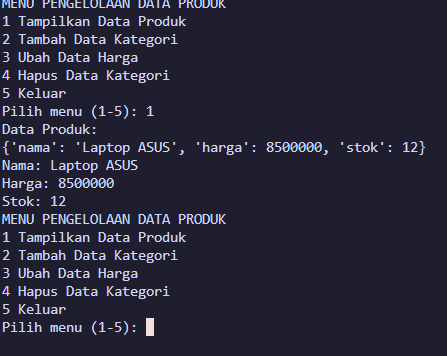
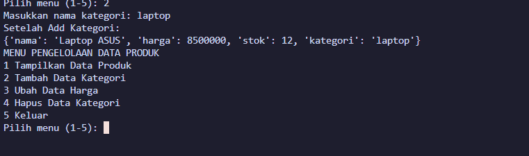
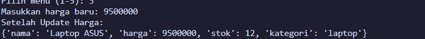
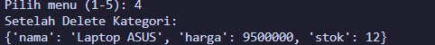

# Program Pengelolaan Data Produk Toko (Studi Kasus 4)

Repositori ini berisi kode program Python untuk tugas **Praktikum Dasar-Dasar Pemrograman (DDP) - Studi Kasus 4 (NIM Genap)**. Program ini dirancang untuk mengelola data produk pada sebuah toko menggunakan struktur data **Dictionary** (*key-value pair*).

---

## 👤 Identitas Praktikan
* **Nama** : M. Fairuz Firerza Aliushami
* **NIM** : 2609116062
* **Kelas** : Sistem Informasi B 2026
* **Studi Kasus** : Studi Kasus 4 (NIM Genap - Data Produk)

## 💻 Penjelasan Struktur Kode & Operasi Dictionary

Berikut adalah penjelasan fungsi bagian-bagian kode program yang digunakan:

1. **Inisialisasi Data (`Dictionary`)**:
   Data produk disimpan dalam variabel `produk` bertipe Dictionary:
   * `"nama"`: menyimpan nama produk (`Laptop ASUS`)
   * `"harga"`: menyimpan harga produk (`8500000`)
   * `"stok"`: menyimpan jumlah stok (`12`)

2. **Perulangan Menu (`while True`)**:
   Program menggunakan perulangan uncounted `while True:` agar menu utama terus ditampilkan setelah setiap operasi selesai dijalankan, hingga pengguna memilih menu `5` untuk keluar (`break`).

3. **Tampilkan Data Produk (`Read`)**:
   Mengakses dan menampilkan seluruh data produk beserta nilai spesifik menggunakan kunci/key masing-masing (`produk["nama"]`, `produk["harga"]`, `produk["stok"]`). Jika key `"kategori"` ada di dalam Dictionary, nilainya juga akan ditampilkan.

4. **Tambah Data Kategori (`Create / Add`)**:
   Menambahkan kunci baru `"kategori"` ke dalam Dictionary produk menggunakan instruksi penugasan langsung: `produk["kategori"] = kategori`.

5. **Ubah Data Harga (`Update`)**:
   Memperbarui nilai harga produk yang sudah ada menggunakan metode `.update()`, yaitu: `produk.update({"harga": harga_baru})`.

6. **Hapus Data Kategori (`Delete`)**:
   Menghapus kunci `"kategori"` beserta nilainya dari Dictionary menggunakan metode `.pop("kategori")`.

7. **Validasi Menu (`Conditional Statement`)**:
   Menggunakan percabangan `if`, `elif`, dan `else` untuk mengarahkan eksekusi program sesuai dengan angka menu yang diinput oleh pengguna (1-5).

---

## 🖥️ Contoh Tampilan Output Program

### Menu Utama & Tampilkan Data

### Tambah Data Kategori

### Ubah Data Harga

### Hapus Data Kategori

---
